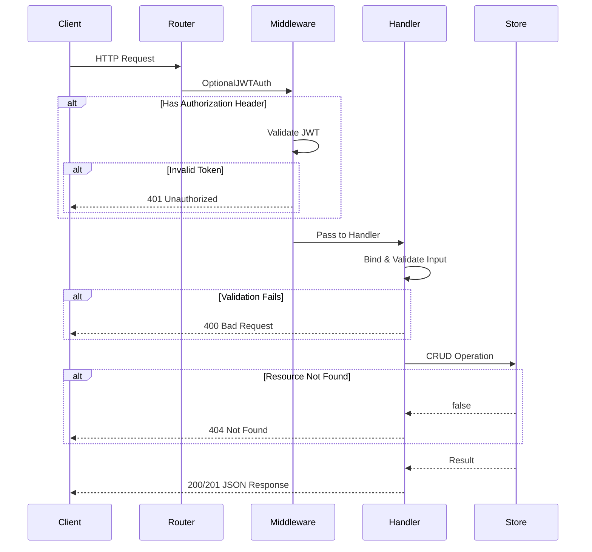
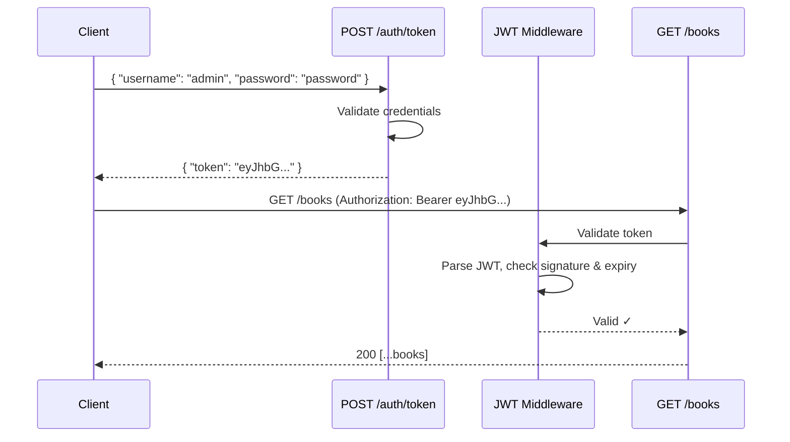

# API Quest

A high-performance REST API built with **Go + Gin** for the [Desent API Quest](https://www.desent.io/coding-test-backend) backend coding challenge. Features JWT authentication, in-memory storage, interactive API docs via Scalar, and is deployed on Fly.io.

**Live URL:** [https://api-quest-1045924354339.asia-southeast1.run.app](https://api-quest-1045924354339.asia-southeast1.run.app)
**API Docs:** [https://api-quest-1045924354339.asia-southeast1.run.app/docs](https://api-quest-1045924354339.asia-southeast1.run.app/docs)

---

## Tech Stack

| Component | Technology                                                                         |
| --------- | ---------------------------------------------------------------------------------- |
| Language  | Go 1.25                                                                            |
| Framework | [Gin](https://github.com/gin-gonic/gin) v1.11.0                                    |
| Auth      | JWT via [golang-jwt/jwt](https://github.com/golang-jwt/jwt) v5                     |
| API Docs  | [Scalar](https://scalar.com) via [scalar-go](https://github.com/pakornv/scalar-go) |
| Storage   | In-memory (`sync.RWMutex` + `map`)                                                 |
| UUID      | [google/uuid](https://github.com/google/uuid)                                      |
| Hosting   | [Fly.io](https://fly.io) (Singapore region)                                        |

---

## Architecture

```
┌─────────────────────────────────────────────────────────┐
│                       main.go                           │
│              (Entry Point + Graceful Shutdown)           │
└──────────────────────┬──────────────────────────────────┘
                       │
                       ▼
┌─────────────────────────────────────────────────────────┐
│                   router/router.go                      │
│           (Route Registration + Scalar Docs)            │
│                                                         │
│  Public:     GET /ping, POST /echo, POST /auth/token    │
│  Protected:  /books/* (OptionalJWTAuth middleware)       │
│  Docs:       GET /docs                                  │
└──────┬───────────────┬──────────────────┬───────────────┘
       │               │                  │
       ▼               ▼                  ▼
┌─────────────┐ ┌─────────────┐ ┌──────────────────┐
│  middleware/ │ │  handler/   │ │   docs/          │
│  jwt.go     │ │  ping.go    │ │   openapi.yaml   │
│             │ │  echo.go    │ │   (OpenAPI 3.1)  │
│ • JWTAuth   │ │  book.go    │ └──────────────────┘
│ • Optional  │ │  auth.go    │
│   JWTAuth   │ └──────┬──────┘
└─────────────┘        │
                       ▼
              ┌──────────────────┐
              │  store/          │
              │  book_store.go   │
              │                  │
              │  sync.RWMutex    │
              │  + map[string]   │
              │    Book          │
              └──────────────────┘
```

### Layer Responsibilities

| Layer          | Package               | Purpose                                                            |
| -------------- | --------------------- | ------------------------------------------------------------------ |
| **Config**     | `internal/config`     | Loads environment variables (`PORT`, `JWT_SECRET`) with defaults   |
| **Model**      | `internal/model`      | Data structures, request/response DTOs, validation binding tags    |
| **Store**      | `internal/store`      | Thread-safe in-memory CRUD with `sync.RWMutex`, search, pagination |
| **Handler**    | `internal/handler`    | HTTP request handlers — binds input, calls store, returns JSON     |
| **Middleware** | `internal/middleware` | JWT validation (strict & optional modes)                           |
| **Router**     | `internal/router`     | Gin engine setup, route groups, middleware wiring, Scalar docs     |

---

## Project Structure

```
api-quest/
├── main.go                       # Entry point + graceful shutdown
├── go.mod / go.sum               # Go module dependencies
├── Dockerfile                    # Multi-stage build (builder → alpine)
├── fly.toml                      # Fly.io deployment config
├── docs/
│   └── openapi.yaml              # OpenAPI 3.1 specification
└── internal/
    ├── config/
    │   └── config.go             # App configuration
    ├── model/
    │   └── book.go               # Book, DTOs, error/pagination types
    ├── store/
    │   └── book_store.go         # In-memory book store
    ├── handler/
    │   ├── ping.go               # GET /ping
    │   ├── echo.go               # POST /echo
    │   ├── book.go               # CRUD + search + paginate + errors
    │   └── auth.go               # POST /auth/token (JWT)
    ├── middleware/
    │   └── jwt.go                # JWT auth middleware
    └── router/
        └── router.go             # Route registration
```

---

## Request Flow



---

## API Endpoints

### Level 1 — Ping

```
GET /ping → 200 { "message": "pong" }
```

### Level 2 — Echo

```
POST /echo → 200 (echoes back the JSON body)
```

### Level 3 — CRUD: Create & Read

```
POST   /books      → 201 (create book)
GET    /books      → 200 (list all books)
GET    /books/:id  → 200 (get single book)
```

### Level 4 — CRUD: Update & Delete

```
PUT    /books/:id  → 200 (update book)
DELETE /books/:id  → 204 (delete book)
```

### Level 5 — Auth Guard

```
POST /auth/token → 200 { "token": "..." }
  Body: { "username": "admin", "password": "password" }

GET /books (with Authorization: Bearer <token>) → 200
GET /books (with invalid token) → 401
```

### Level 6 — Search & Paginate

```
GET /books?author=X          → 200 (filtered by author)
GET /books?page=1&limit=2    → 200 { "data": [...], "page": 1, "limit": 2, "total": N }
```

### Level 7 — Error Handling

```
POST /books (invalid body) → 400 { "error": "..." }
GET  /books/:id (missing)  → 404 { "error": "book not found" }
```

### Level 8 — Boss: Speed Run

All previous endpoints — optimized by Gin's performance + RWMutex concurrent reads.

---

## Auth Flow



The middleware uses **optional auth** — if no `Authorization` header is present, the request passes through (for public access in Levels 3-4). If a header IS present, it must be a valid JWT or the request is rejected with `401`.

---

## Running Locally

```bash
# Clone and install
git clone https://github.com/didikurnia/api-quest.git
cd api-quest
go mod download

# Run
go run main.go

# Server starts at http://localhost:8080
# Docs at http://localhost:8080/docs
```

### Environment Variables

| Variable     | Default            | Description        |
| ------------ | ------------------ | ------------------ |
| `PORT`       | `8080`             | Server port        |
| `JWT_SECRET` | Random 32-byte hex | JWT signing secret |

---

## Deployment (Fly.io)

```bash
# Install flyctl
# https://fly.io/docs/flyctl/install/

# Login
fly auth login

# Deploy
fly deploy

# Check status
fly status
fly logs
```

The app deploys as a Docker container (multi-stage build: `golang:1.25-alpine` → `alpine:3.20`) to Fly.io's Singapore region with auto-scaling.

---

## Design Decisions

1. **In-memory storage** — The challenge allows it; no database overhead means blazing fast responses for the Speed Run level.

2. **`sync.RWMutex`** — Allows concurrent reads while serializing writes, optimal for read-heavy API testing.

3. **Optional JWT middleware** — Single route group for `/books` handles both public (L3-4) and protected (L5) access without duplicate routes.

4. **Insertion-order preservation** — Books are stored in a `map` but a separate `[]string` slice tracks insertion order for deterministic list responses.

5. **Scalar over Swagger UI** — Modern, clean API docs with built-in code snippets, try-it-out functionality, and better DX.
